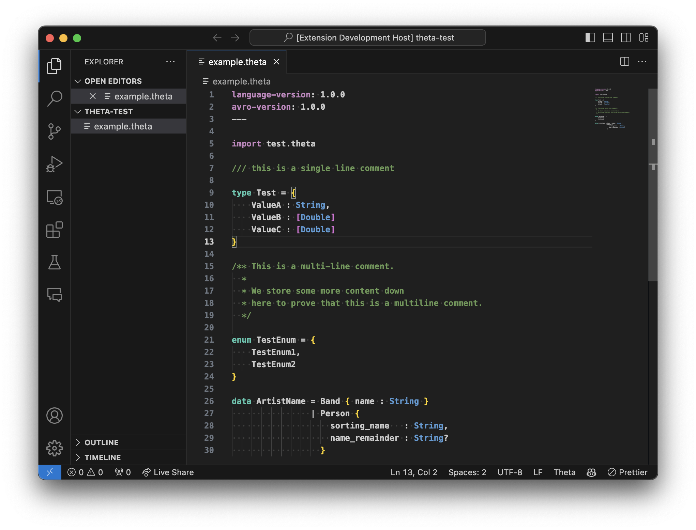

# `vscode-theta`

[](https://marketplace.visualstudio.com/items?itemName=jake-hwll.vscode-theta)

Syntax highlighting support for [`theta-idl`](https://github.com/target/theta-idl) in Visual Studio Code.



> [!WARNING]  
> This library is heavily a work-in-progress and a largely first-attempt at a language definition in VSCode/Textmate. [Please excuse any underlying issues and raise them!](https://github.com/jakehwll/vscode-theta/issues)

## Quick Start

```sh
# Get the source code
git clone git@github.com:jakehwll/vscode-theta.git
# Open the project in Visual Studio Code
code vscode-theta
# Install dependencies
npm install
# Compile the extension
npm run watch
# Or alternatively,
# npm run compile
```

Within `Visual Studio Code` you can then press `F5` to launch the extension in developer mode.

## Tests

You can find tests within the [TESTS.md](/TESTS.md) file.
